class: title-slide

```{r setup, include=FALSE}
knitr::opts_chunk$set(echo = FALSE, fig.path = "figures/")
library(tidyverse)
library(magick)
library(reticulate)
library(knitr)
use_python("/Users/ulyngs/opt/anaconda3/bin/python")
xfun::pkg_load2(c('base64enc', 'htmltools', 'mime'))
```

.row[
.col-7[
.title[
# Hello, R Markdown!
]
.subtitle[
<!-- ## How to Write <br> Reproducible Papers -->
### Oxford|Berlin Summerschool, <br> 23 September 2021
]
.author[
### Ulrik Lyngs <br> [ulriklyngs.com](https://ulriklyngs.com) <br> [<i class="fab fa-github"></i>](https://github.com/ulyngs) [<i class="fab fa-twitter"></i>](https://twitter.com/ulyngs)[<i class="ai ai-google-scholar"></i>](https://scholar.google.co.uk/citations?user=e8XDAzcAAAAJ&hl=en)
]

.affiliation[
### Department of Computer Science <br> University of Oxford
]

]

.col-5[

.logo[
```{r}

```
]

Slides:<br> [ulyngs.github.io/oxberlin-2021-rmd-workshop/](https://ulyngs.github.io/oxberlin-2021-rmd-workshop/)

Materials:<br> [github.com/ulyngs/oxberlin-2021-rmd-workshop](https://github.com/ulyngs/oxberlin-2021-rmd-workshop)

R Markdown band artwork by [@allison_horst](https://github.com/allisonhorst/stats-illustrations)
]

]

???
- I'm Ulrik, and this workshop is about how to use R Markdown to make reproducible research easy and fun!
- I assume there will have been some mention of this in the workshop on Monday on reproducible workflows in R, but here we'll go a bit more into depth
- before I say more, I'll start by showing a clip from my favourite scary movie

---
class: center, top, black-background

<iframe width="1600" height="660" src="https://www.youtube.com/embed/s3JldKoA0zw" frameborder="0" allow="fullscreen;" allowfullscreen="1"></iframe>

---
class: center, middle, inverse

# Who am I?

???

- who am I?
- postdoc, [Human Centred Computing Group](https://www.cs.ox.ac.uk/research/HCC/)
- Cognitive psychologist-turned-computer scientist
- fan of open science, think R Markdown's got a things stuff going for it

---
class: larger-body
# R Markdown nerd

.pull-left[
**Packages for paper, thesis, CV writing with R markdown**
- ACM CHI conference - [proceedings](https://github.com/ulyngs/chi-proc-rmd-template) and [extended abstracts](https://github.com/ulyngs/chi-ea-rmd-template) format
- Example paper on OSF: [Self-Control in Cyberspace: Applying Dual Systems Theory to Self-Control Tools](https://osf.io/zyj4h/) 
- [`oxforddown`](https://github.com/ulyngs/oxforddown) template for Oxford University thesis writing
- [`pagedown cv`](https://github.com/ulyngs/pagedown-cv) template for writing your CV in R Markdown and pull in content automatically from spreadsheet
]

--
.pull-right[
**Blogging (in and about R Markdown)**
- [How to adapt journals' LaTeX templates for use with R Markdown](https://ulyngs.github.io/blog/posts/2018-10-28-how-to-write-acm-articles-with-r-markdown/)
- [How to create custom chunk options](https://ulyngs.github.io/blog/posts/2019-02-01-how-to-create-your-own-chunk-options-in-r-markdown/)
- [Advanced customisation with pandoc filters](https://ulyngs.github.io/blog/posts/2019-02-19-how-to-use-pandoc-filters-for-advanced-customisation-of-your-r-markdown-document/)
]

???
wrote my entire phd thesis in it and use it for everything from basic data analysis to interactive dashboards and even the songbook for my live karaoke band

---
class: inverse, center, middle

# Plan

---
class: middle, very-large-body
.pull-left[
## What we'll do
- Why R Markdown?
- Basic syntax: Markdown & code
- Final pieces: Citations & cross-referencing (+ the Visual Editor)
]

--
.pull-right[
## Bonus: LaTeX templates
- Adapting a journal's LaTeX template for use w/ R Markdown
]

???
- we're going to pause along the way to do some exercises in breakout rooms
- 3 levels of exercises, so that there should be something for everyone
- ask: how many know what R Markdown is
- among those who do, how many consider themselves: i) beginners, ii) medium, iii) experts

---
class: center, middle, inverse

# Why R Markdown?

---
class: very-large-body
# Wouldn't it be great if...

--
- You could have code, results, and text in the same document?

--
- Your results and plots were automatically generated from your data, so your documents were updated if your data changed?

--
- The file format of your documents was future-proof?

--
- The syntax for this was easy?

---
# Wouldn't it be great if...

.pull-left[
- You could have code, results, and text in the same document?
- Your results and plots were automatically generated from your data, so your documents were updated if your data changed?
- The file format of your documents was future-proof?
- The syntax for this was easy?
]

.pull-right[
```{r, out.width="95%"}
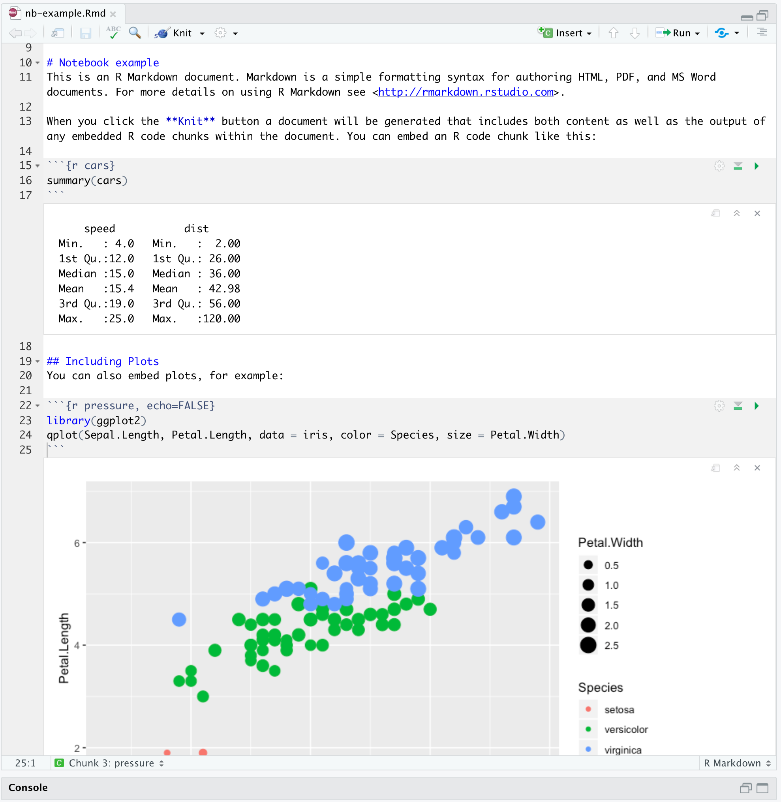
```

*Interactive notebook*

]

---
# Wouldn't it be great if...

.pull-left[
- You could have code, results, and text in the same document?
- Your results and plots were automatically generated from your data, so your documents were updated if your data changed?
- The file format of your documents was future-proof?
- The syntax for this was easy?
]

.pull-right[
```{r, echo=FALSE}
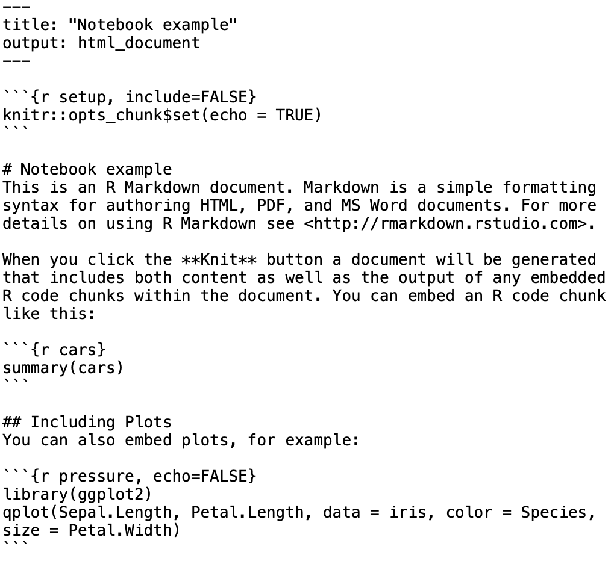
```
*Plain text*
]

--
.on-top-right[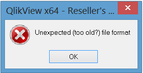]

---
# Wouldn't it be great if...

.pull-left[
- You could have code, results, and text in the same document?
- Your results and plots were automatically generated from your data, so your documents were updated if your data changed?
- The file format of your documents was future-proof?
- The syntax for this was easy?
]

.pull-right[
```{r, echo=FALSE}
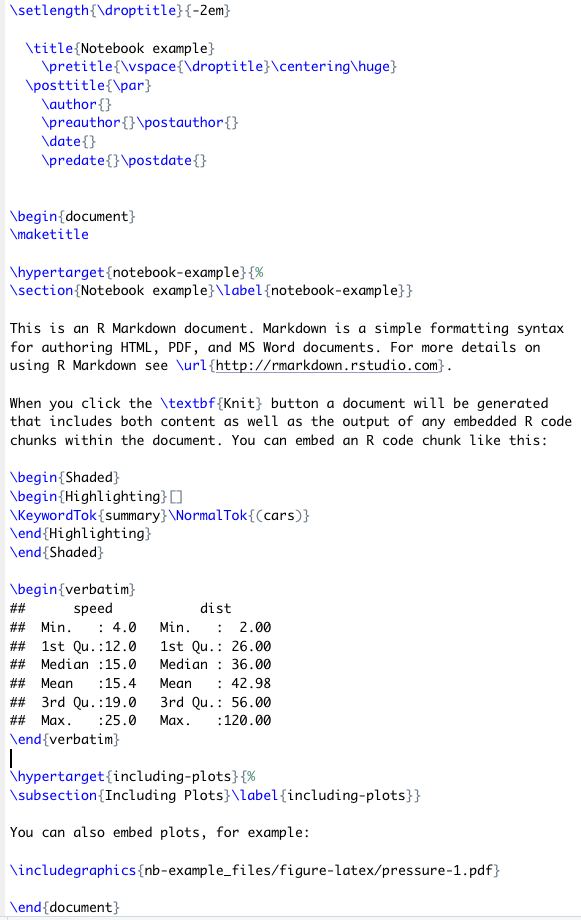
```

]

---
# Wouldn't it be great if...

.pull-left[
- You could have code, results, and text in the same document?
- Your results and plots were automatically generated from your data, so your documents were updated if your data changed?
- The file format of your documents was future-proof?
- The syntax for this was easy?
]

.pull-right[
```{r, echo=FALSE}
#image_read("figures/markdown-ref.png") %>% 
#  image_crop("1030x900+0+95") %>% 
#  image_write("figures/cropped.png", format = "png")
knitr::include_graphics("figures/cropped.png")
```

*Markdown*
]

---

.row[
.col-6[
<blockquote class="twitter-tweet" data-lang="en-gb"><p lang="en" dir="ltr">Hey, here&#39;s a short story whose moral is this: Consider writing empirical reports in RMarkdown... THREAD /1</p>&mdash; Heather Urry (@HeatherUrry) <a href="https://twitter.com/HeatherUrry/status/1100585163829006341?ref_src=twsrc%5Etfw">27 February 2019</a></blockquote> <script async src="https://platform.twitter.com/widgets.js" charset="utf-8"></script> 
]
]

???
psychology professor at tufts university

---

.row[
.col-6[
<blockquote class="twitter-tweet" data-lang="en-gb"><p lang="en" dir="ltr">Hey, here&#39;s a short story whose moral is this: Consider writing empirical reports in RMarkdown... THREAD /1</p>&mdash; Heather Urry (@HeatherUrry) <a href="https://twitter.com/HeatherUrry/status/1100585163829006341?ref_src=twsrc%5Etfw">27 February 2019</a></blockquote> <script async src="https://platform.twitter.com/widgets.js" charset="utf-8"></script> 
]

.col-6[
<blockquote class="twitter-tweet" data-conversation="none" data-lang="en-gb"><p lang="en" dir="ltr">A new PDF compiled in a matter of seconds with all of the results - text stats, tables, figures - updated automatically throughout the manuscript LIKE MAGIC. ITS LIKE GODDAMN FUCKING MAGIC. /9 <a href="https://t.co/x32sN8eaai">pic.twitter.com/x32sN8eaai</a></p>&mdash; Heather Urry (@HeatherUrry) <a href="https://twitter.com/HeatherUrry/status/1100585195349135361?ref_src=twsrc%5Etfw">27 February 2019</a></blockquote> <script async src="https://platform.twitter.com/widgets.js" charset="utf-8"></script> 
]

]

---

.row[
.col-6[
<blockquote class="twitter-tweet" data-lang="en-gb"><p lang="en" dir="ltr">Hey, here&#39;s a short story whose moral is this: Consider writing empirical reports in RMarkdown... THREAD /1</p>&mdash; Heather Urry (@HeatherUrry) <a href="https://twitter.com/HeatherUrry/status/1100585163829006341?ref_src=twsrc%5Etfw">27 February 2019</a></blockquote> <script async src="https://platform.twitter.com/widgets.js" charset="utf-8"></script> 

<blockquote class="twitter-tweet" data-lang="en-gb"><p lang="en" dir="ltr">My point is this: If you think you&#39;ll ever be in the position of having to re-do stats for a manuscript at some point - and, c&#39;mon, you know you will - then invest some time in establishing a reproducible manuscript workflow. 11/</p>&mdash; Heather Urry (@HeatherUrry) <a href="https://twitter.com/HeatherUrry/status/1100585200159985665?ref_src=twsrc%5Etfw">27 February 2019</a></blockquote> <script async src="https://platform.twitter.com/widgets.js" charset="utf-8"></script> 


]

.col-6[
<blockquote class="twitter-tweet" data-conversation="none" data-lang="en-gb"><p lang="en" dir="ltr">A new PDF compiled in a matter of seconds with all of the results - text stats, tables, figures - updated automatically throughout the manuscript LIKE MAGIC. ITS LIKE GODDAMN FUCKING MAGIC. /9 <a href="https://t.co/x32sN8eaai">pic.twitter.com/x32sN8eaai</a></p>&mdash; Heather Urry (@HeatherUrry) <a href="https://twitter.com/HeatherUrry/status/1100585195349135361?ref_src=twsrc%5Etfw">27 February 2019</a></blockquote> <script async src="https://platform.twitter.com/widgets.js" charset="utf-8"></script> 
]

]

???
maybe embed this one too: https://twitter.com/dgkeyes/status/1101554699566641152

---

class: center, middle, inverse

# Anatomy of an <br> R Markdown Document

---
**R Markdown file = plain text file with extension _.Rmd_**

````markdown
---
title: "Diamond sizes"
date: 2016-08-25
output: html_document
---

`r ''````{r setup, include=FALSE}
library(ggplot2)
library(dplyr)

smaller <- diamonds %>% 
  filter(carat <= 2.5)
```

# Shine bright like a diamond
We have data about `r knitr::inline_expr("nrow(diamonds)")` diamonds.
Only `r knitr::inline_expr("nrow(diamonds) - nrow(smaller)")` are larger than 2.5 carats. 
The distribution of the remainder is shown below:

`r ''````{r}
smaller %>% 
  ggplot(aes(carat)) + 
  geom_freqpoly(binwidth = 0.01)
  
```
````

???
This is what an R Markdown file looks like - plain text that you save with the extension .Rmd

It has three parts

---

**YAML header ("YAML Ain't Markup Language")**

````markdown
*---
*title: "Diamond sizes"
*date: 2016-08-25
*output: html_document
*---

`r ''````{r setup, include=FALSE}
library(ggplot2)
library(dplyr)

smaller <- diamonds %>% 
  filter(carat <= 2.5)
```

# Shine bright like a diamond
We have data about `r knitr::inline_expr("nrow(diamonds)")` diamonds.
Only `r knitr::inline_expr("nrow(diamonds) - nrow(smaller)")` are larger than 2.5 carats. 
The distribution of the remainder is shown below:

`r ''````{r}
smaller %>% 
  ggplot(aes(carat)) + 
  geom_freqpoly(binwidth = 0.01)
  
```
````

???
- a header between three dashes
- we have these key-value pairs, like 'title: "Diamond sizes"'
- with these we specify meta-data about the document, such as title, author date, etc. and information about what kind of output format we want

---

**Text**

````markdown
---
title: "Diamond sizes"
date: 2016-08-25
output: html_document
---

`r ''````{r setup, include=FALSE}
library(ggplot2)
library(dplyr)

smaller <- diamonds %>% 
  filter(carat <= 2.5)
```

*# Shine bright like a diamond
*We have data about `r knitr::inline_expr("nrow(diamonds)")` diamonds.
*Only `r knitr::inline_expr("nrow(diamonds) - nrow(smaller)")` are larger than 2.5 carats.
*The distribution of the remainder is shown below:

`r ''````{r}
smaller %>% 
  ggplot(aes(carat)) + 
  geom_freqpoly(binwidth = 0.01)

```
````

---
**Code**

````markdown
---
title: "Diamond sizes"
date: 2016-08-25
output: html_document
---

*`r ''````{r setup, include=FALSE}
*library(ggplot2)
*library(dplyr)
*
*smaller <- diamonds %>% 
* filter(carat <= 2.5)
*```

# Shine bright like a diamond
We have data about `r knitr::inline_expr("nrow(diamonds)")` diamonds.
Only `r knitr::inline_expr("nrow(diamonds) - nrow(smaller)")` are larger than 2.5 carats. 
The distribution of the remainder is shown below:

*`r ''````{r}
*smaller %>% 
* ggplot(aes(carat)) + 
* geom_freqpoly(binwidth = 0.01)
*
*```
````

---
class: center, middle, inverse

# What Can It Do? <br> Output formats

---

```{r, out.width="80%", fig.align='center'}
knitr::include_graphics("figures/rmarkdown_universe.jpg")
```

.pull-left[
```yaml
---
output: html_document
---
```
]

.pull-right[
```yaml
---
output: pdf_document
---
```
]

???
let's do a quick demo

credit: https://www.williamrchase.com/slides/intro_r_anthropology_2018#82

---

class: center, middle, inverse


---
class: center, middle

# Basic syntax

---
class: syntax-slide

.pull-left[
  ### This...
  \*italics\* and \*\*bold\*\*  
  
  <span>&#96;</span>inline code&#96;
  
  sub~2~/superscript^2^
  
  \~\~strikethrough\~\~
  
  escaped: \\* \\_ \\\
  
  endash: --, emdash: ---
  
  \> blockquote
  
  \# Header 1
  
  \#\# Header 2
  
  *Line break: End line with 2+ spaces, or backslash:* <br>
  Roses are red <br>
  Violets are blue
  
  Roses are red \ <br>
  Violets are blue
]

.pull-right[
  ### turns into this...
  *italics* and **bold**
  
  `inline code`
  
  sub<sub>2</sub>/superscript<sup>2</sup>
  
  ~~strikethrough~~
  
  escaped: \* \_ \\
  
  endash: &ndash;, emdash: &mdash;
  
  > blockquote
  
  # Header 1
  ## Header 2
  
  Roses are red Violets are blue
  
  Roses are red <br>
  Violets are blue
]

---
class: syntax-slide 
.pull-left[
  ### This...
  
  \- unordered list <br>
  &nbsp; &nbsp; \- sub-item <br>
  &nbsp; &nbsp; \- sub-item 2 <br>
  &nbsp; &nbsp; &nbsp; \- sub-sub-item
  
  1\. ordered list <br>
  2\. item 2 <br>
  &nbsp; &nbsp; \- sub-item 1 <br>
  &nbsp; &nbsp; \- sub-item 2
  

  <br>
  inline-math: &#36;A = \pi*r^{2}&#36;
  
  math-block: <span>&#36;</span>&#36;A = \pi*r^{2}&#36;&#36;
  
  \[text for hyperlink\](https://www.google.com)
  
  A footnote [^1]
  
  [^1]: here is the footnote text.
  
  <span><!-</span>- this is a comment that won't be shown -<span>-></span>
  
]
.pull-right[
  ### turns into this...
  
  - unordered list
    - sub-item
    - sub-item 2
      - sub-sub-item
  
  1. ordered list
  1. item 2 <br>
    i. sub-item 1 <br>
    ii. sub-item 2
  
  inline-math: $A = \pi*r^{2}$
  
  math-block: $$A = \pi*r^{2}$$
  
  [text for hyperlink](https://www.google.com)
  
  A footnote<sup>1</sup>
  
  .footnote[[1] Here is the footnote text.]
  
]

---
class: practice-slide

.center[
# Time for practice!
]

Everybody should already have on their laptops...
- [R](https://cran.rstudio.com) and [RStudio](https://www.rstudio.com/products/rstudio/download/preview/) + R packages `bookdown` and `tidyverse` (`install.packages("package-name")`)
- a LaTeX installation, for knitting to PDF (`tinytex::install_tinytex()`)
- Trouble? Go to https://rstudio.cloud/project/2898096 and set up an RStudio Cloud account

.row[

.col-4[
## Beginner
]
.col-4[
## Intermediate
]
.col-4[
## Advanced
]

]

.row[

.col-4.beginner[
*Create a new R Markdown file* <br>
(File > New File > R Markdown...)

*Knit to HTML, PDF, Word*

*Tweak the content*
- add your name and today's date to the YAML header
- add a paragraph with a header, **bold**, and *italics*
- how do you create linebreaks and new paragraphs?
]
  
.col-4.intermediate[
In a new R Markdown file, add a paragraph that contains
- a hyperlink
- a blockquote
- a comment
- a footnote

Skim through the references available from within RStudio:
- Help > Cheatsheets > R Markdown Cheat Sheet
- Help > Cheatsheet > R Markdown Reference Guide
]

.col-4.advanced[
- When making footnotes, what are the two ways to create the actual footnote text?
- How do you get literal backticks (&#96;) in your output?
- What's the difference between outputting to `rmarkdown::pdf_document` and `bookdown::pdf_document2`?

]

]

---
class: center, middle, inverse

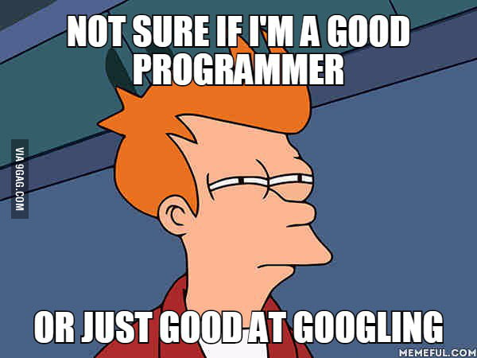

---
class: center, middle

# Wonderful markdown-in-10-mins tutorial: <br> https://www.markdowntutorial.com

---
class: center, middle

# Code

---
class: small-font
# Code chunks


--

**Some common chunk options** (see e.g. [bookdown.org](https://bookdown.org/yihui/rmarkdown/r-code.html))
- `echo`: whether or not to display code in knitted output
- `eval`: whether or to to run the code in the chunk when knitting
- `fig.cap`: figure caption

---
class: larger-body
# Typical chunks
### Setup chunk
````markdown
`r ''````{r setup, include=FALSE}
# don't show code unless we explicitly set echo = TRUE
knitr::opts_chunk$set(echo = FALSE)

library(tidyverse)
```
````

--
- Normally, an R Markdown document starts with a chunk that's used to set some options and load required libraries.

--
- `knitr::opts_chunk$set` sets default options for all chunks.


---
### Including images

.pull-left[
````markdown
`r ''````{r, fig.cap="R Markdown logo"}
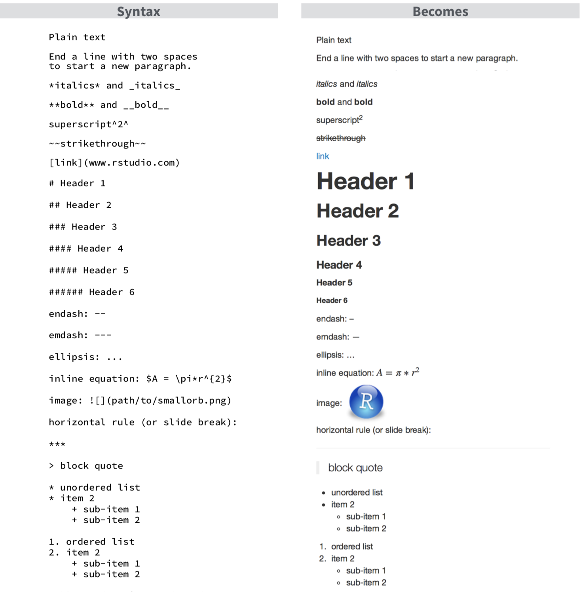
```
````
]

.pull-right[
```{r, out.width="60%", fig.align='center', fig.cap="R Markdown logo"}
knitr::include_graphics("figures/rmarkdown.png")
```

]

---
### Including plots

.pull-left[
````markdown
`r ''````{r, fig.cap="A ggplot of car stuff"}
cars %>% 
  ggplot() +
    aes(x = speed, y = dist) +
    geom_point()
```
````

]

.pull-right[
```{r, out.width="90%", fig.align='center', fig.retina = 3, fig.cap="A ggplot of car stuff"}
cars %>% 
  ggplot() +
    aes(x = speed, y = dist) +
    geom_point()
```
]


---
class: larger-body
### Including tables

.pull-left[
````markdown
`r ''````{r}
# cars is a built-in-to-R data set of cars
# and their stopping distances

cars %>% 
  head() %>% 
  knitr::kable(caption = "A knitr kable table")
  
```
````
]

.pull-right[
```{r}
cars %>% 
  head(5) %>% 
  knitr::kable(format = "html", caption = "A knitr kable table")
```

]

---
class: larger-body
### Including tables

.pull-left[
````markdown
`r ''````{r}
# cars is a built-in-to-R data set of cars
# and their stopping distances

cars %>% 
  head() %>% 
* knitr::kable(caption = "A knitr kable table")
  
```
````
]

.pull-right[
```{r}
cars %>% 
  head(5) %>% 
  knitr::kable(format = "html", caption = "A knitr kable table")
```

]

<br>

- Gotcha: when using [`kable`](https://www.rdocumentation.org/packages/knitr/versions/1.21/topics/kable), captions  are set inside the `kable` function

--
- The `kable` package is often used with the [`kableExtra`](https://cran.r-project.org/web/packages/kableExtra/vignettes/awesome_table_in_html.html) package
- A number of other packages are available for making pretty tables, see [rmarkdown.rstudio.com](https://rmarkdown.rstudio.com/lesson-7.html)

---
class: larger-body
# Inline code

--
Inside your text you can include code with the syntax <span>&#96;</span>r code here&#96;.


--
For example, <span>&#96;</span>r 4 + 4&#96; would output `r 4 + 4` in your text.

--
```{r, echo = TRUE}
as_tibble(cars)
```

--
.pull-left[
There are <span>&#96;</span>r nrow(cars)&#96; rows in the `cars` dataset.
]

--
.pull-right[
There are `r nrow(cars)` rows in the `cars` dataset.
]


---
class: larger-body
# Inline code with python

--
[At the moment](https://stackoverflow.com/questions/47818461/is-there-a-way-in-knitr-to-evaluate-inline-code-chunks-of-other-languages), syntax like <span>&#96;</span>python code here&#96; is not valid.


--
However, you can use the [`reticulate`](https://rstudio.github.io/reticulate/articles/r_markdown.html) package to access variables from python chunks.

--
````markdown
`r ''````{python}
my_number = 4 + 8

print(my_number)

```
````

```{python}
my_number = 4 + 8
print(my_number)
```

--
````markdown
`r ''````{r}
library(reticulate)

py$my_number

```
````

```{r}
py$my_number
```

--
Inline you can then refer to this python variable with <span>&#96;</span>r py$my_number&#96; - `my_number` is `r py$my_number`.


---
class: larger-body
.center[
# Time for practice!
]

.row[

.col-4[
## Beginner
]
.col-4[
## Intermediate
]
.col-4[
## Advanced
]

]

--
.row[

.col-4.beginner[
Open the file **using_code.Rmd**, then

1. include the image **figures/1920_car.jpg** with `knitr::include_graphics`
2. plot speed vs distance in the `cars` dataset (use `plot(cars)`)
3. include a table of the cars dataset
4. report the mean of the speed column in the cars dataset (`mean(cars$speed)`) with inline code
]
  
.col-4.intermediate[
1. Try resizing plots and images with `out.width` and `fig.width` - what's the difference?
2. How do you set `knitr`'s global options to hide code by default?
3. What other options are available to control if a code block is executed and what results are inserted in the finished report? (Hint: see [R for Data Science, 27.4.2](https://r4ds.had.co.nz/r-markdown.html))
]

.col-4.advanced[
1. What's the use of `cache = TRUE`? How does it relate to the `dependson` chunk option?
2. How might you create new chunk options, if the ones provided by `knitr` are not sufficient?
]
]

???
Beginner

Intermed
1. aspect ratio in generated plot vs resizing after the fact (https://sebastiansauer.github.io/figure_sizing_knitr/)

Advanced
2. see my blogpost, https://ulyngs.github.io/blog/posts/2019-02-01-how-to-create-your-own-chunk-options-in-r-markdown/


---
class: center, middle, inverse

# Final pieces

---
class: larger-body
# Citations

--
<ol>
<li> Your references should live in a plain text file with the extension **.bib**, in **BibTex** format. 
<br>In the highlighed section, 'Shea2014' is the **citation identifier**.
</ol>
```bibtex
*@article{Shea2014,
  author =        {Shea, Nicholas and Boldt, Annika},
  journal =       {Trends in Cognitive Sciences},
  pages =         {186--193},
  title =         {{Supra-personal cognitive control}},
  volume =        {18},
  year =          {2014},
  doi =           {10.1016/j.tics.2014.01.006},
}
```

--
<ol start = 2>
<li>Reference the **.bib** file in your YAML header
</ol>
```yaml
---
title: "Citation test"
*bibliography: references.bib
output: html_document
---
```

---
class: larger-body
# Citations
<ol start = 3>
<li>In your text, citations go inside brackets and separated by semicolons.
</ol>

--
.pull-left[
### This...
Blah blah [@Shea2014; @Lottridge2012].
]

.pull-right[
### turns into this...
  
Blah blah (Shea et al. 2014; Lottridge et al. 2012).
]

---
class: larger-body
# Citations
<ol start = 3>
<li>In your text, citations go inside brackets and separated by semicolons.
</ol>


.pull-left[
### This...
Blah blah [@Shea2014; @Lottridge2012].

Shea et al. says blah [-@Shea2014].

]

.pull-right[
### turns into this...
  
Blah blah (Shea et al. 2014; Lottridge et al. 2012).

Shea et al. says blah (2014).

]

---
class: larger-body
# Citations
<ol start = 3>
<li>In your text, citations go inside brackets and separated by semicolons.
</ol>


.pull-left[
### This...
Blah blah [@Shea2014; @Lottridge2012].

Shea et al. says blah [-@Shea2014].

@Shea2014 says blah.

]

.pull-right[
### turns into this...
  
Blah blah (Shea et al. 2014; Lottridge et al. 2012).

Shea et al. says blah (2014).

Shea et al. (2014) says blah.

]

---
class: larger-body
# Citations
<ol start = 3>
<li>In your text, citations go inside brackets and separated by semicolons.
</ol>


.pull-left[
### This...
Blah blah [@Shea2014; @Lottridge2012].

Shea et al. says blah [-@Shea2014].

@Shea2014 says blah.

Blah blah [see @Shea2014, pp. 33-35; also @Wu2016, ch. 1].
]

.pull-right[
### turns into this...
  
Blah blah (Shea et al. 2014; Lottridge et al. 2012).

Shea et al. says blah (2014).

Shea et al. (2014) says blah.

Blah blah (see Shea et al. 2014, 33–35; also Wu 2016, ch. 1).
]

---
class: larger-body
# Citations
The best way to handle citations is with RStudio's new [Visual Editor](https://rstudio.github.io/visual-markdown-editing/).

To switch into visual mode for a given document, use the <kbd></kbd> button at the top-right of the document toolbar.

--
.pull-left[
```{r, echo=FALSE}
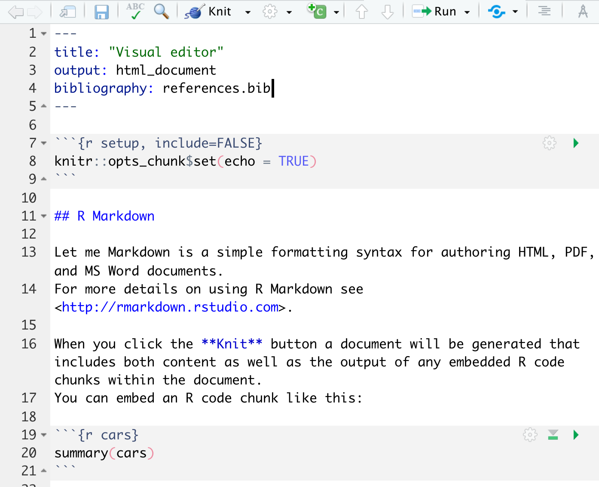
```
]

--
.pull-right[
```{r, echo=FALSE}
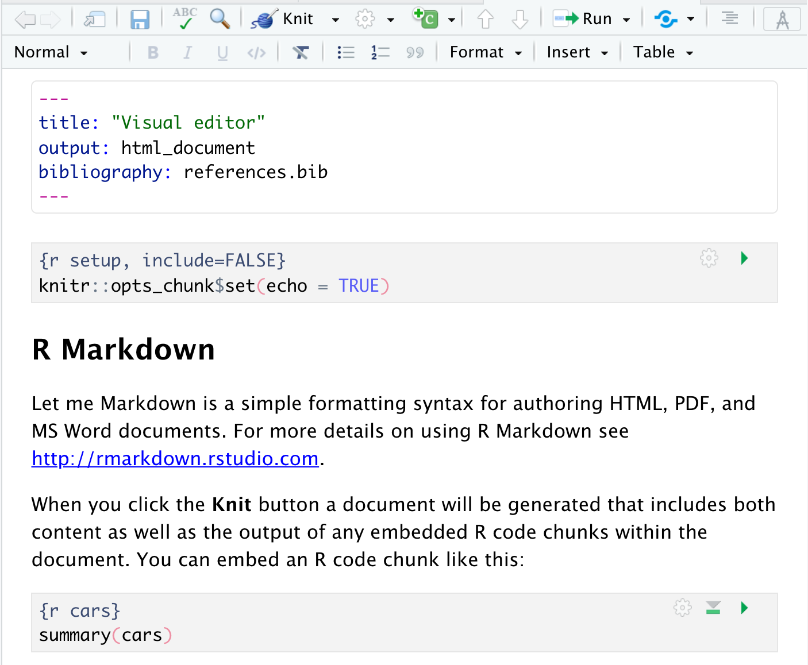
```
]

---
class: larger-body
# Citations
In the visual editor, click Insert -> Citation

From here, you can find and insert citations from your Zotero library, online via a DOI, search PubMed, etc.

The citations you insert are automatically added to your **.bib** file.

.pull-left[
```{r, echo=FALSE, out.width="80%"}
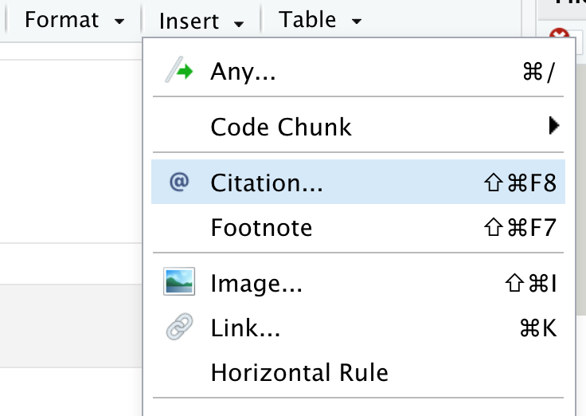
```
]

--

.pull-right[
```{r, echo=FALSE, out.width="60%"}
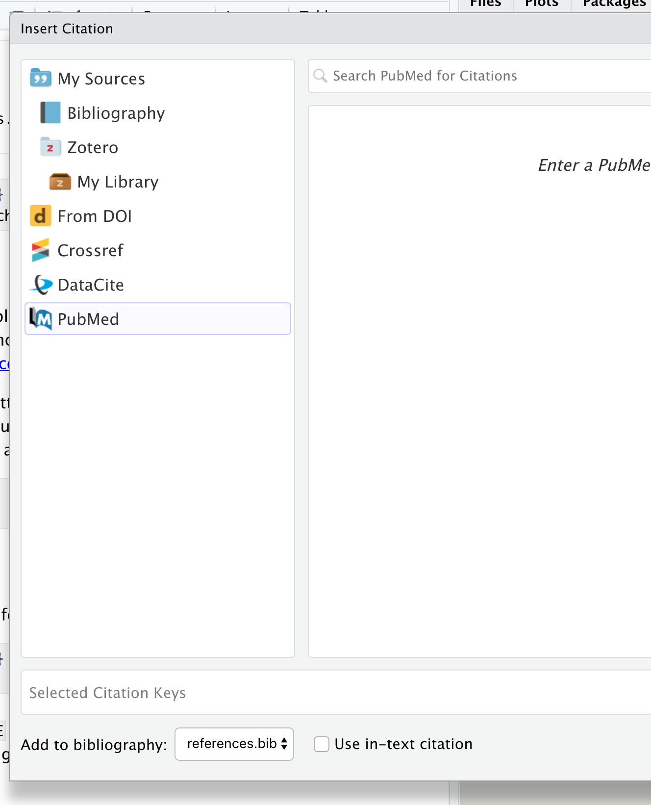
```
]


---

class: center, middle, inverse

# Demo


---
class: larger-body
# Cross-referencing
- For most academic writing you will want to make cross references to **figures**, **tables**, or **sections** within your document.

--
- The `bookdown` package added cross-referencing to R Markdown

--
- To enable cross-referencing, your output should use e.g. `bookdown::html_document2`, `bookdown::pdf_document2`, or `bookdown::word_document2`, in the YAML header (see [bookdown.org](https://bookdown.org/yihui/bookdown/output-formats.html))


--
```yaml
---
title: "Cross-referencing test"
output: bookdown::html_document2
---
```

--
- The basic cross-reference syntax is `\@ref(label)` (simply `@ref(label)` in the Visual Editor)

--
- For figures: `\@ref(fig:label)`, tables: `\@ref(tab:label)`

---
class: larger-body
## Figure references

.pull-left[
````markdown
`r ''````{r captain, fig.cap="A marvel-lous meme"}
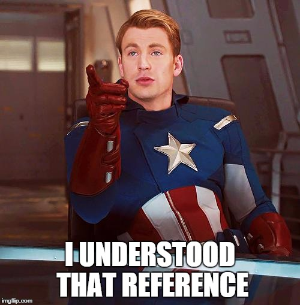
```
````

```{r captain, fig.align='center', fig.cap="A marvel-lous meme", out.width="65%"}

```

]


--
.pull-right[
- Refer to this image with `\@ref(fig:captain)`
]


---
class: larger-body
## Figure and table reference


.pull-left[
````markdown
`r ''````{r cars}
knitr::kable(cars[1:5,],
            caption="Stopping cars")
```
````

```{r cars}
knitr::kable(cars[1:5,],
            caption="Stopping cars")
```

]


--
.pull-right[
- Refer to this table with `\@ref(tab:cars)`
]

--
<br>
<br>
- **GOTCHA**: Figures and tables must have captions if you wish to cross-reference them.

---
class: larger-body
### Section references
- Assing a label to a header by adding `{#label}` after it, e.g. `# My awesome header {#test-label}`.


--
- Then reference `# My awesome header` with `\@ref(test-label)`


--
- .Rmd: `See section \@ref(test-label)` -> output: 'See section 1'

---
class: larger-body
.center[
# Time for practice!
]

.row[

.col-4[
## Beginner
]
.col-4[
## Intermediate
]
.col-4[
## Advanced
]

]

--
.row[

.col-4.beginner[
1. Use the Visual Editor to insert a citation into an R Markdown document - knit to see the result
2. Make cross-references to a figure and a table
]
  
.col-4.intermediate[
1. Add a custom label to a header and use this label to reference the section
2. Try downloading a **.csl** file with a citation style from [zotero.org/styles](https://www.zotero.org/styles). Use this to style the references in your R Markdown document (in your YAML header, use `csl: the-file-you-downloaded.csl`)
]

.col-4.advanced[
2. How do you stop pandoc from automatically inserting cited references by the end of the document?
3. How would you handle a situation where special characters made `fig.cap` mess up? (.black[[hint](https://bookdown.org/yihui/bookdown/markdown-extensions-by-bookdown.html#text-references)])
1. Go to RStudio -> Preferences -> R Markdown -> Visual. Why might it be important to use sentence-level line wrapping?
]
]


---

class: center, middle, inverse

# Bonus: Using templates

---
class: larger-body
## Appearance and style
- For fine-grained control, you can supply a specific template to use for the output document:

```yaml
---
title: "Output customisation"
output: 
  bookdown::html_document2:
*    template: my_template.html

  bookdown::pdf_document2:
*    template: my_template.tex

  bookdown::word_document2:
*    reference_docx: my-styles.docx #note: 'reference_docx'
---
```

--
- For more on HTML templates, see the [pandoc documentation](http://pandoc.org/MANUAL.html#templates) and/or have a look at the [default HTML template](https://github.com/jgm/pandoc-templates/blob/master/default.html5)
- For more on Word templates, watch this short video ([vimeo.com/110804387](https://vimeo.com/110804387)), or read this article ([rmarkdown.rstudio.com/articles_docx.html](https://rmarkdown.rstudio.com/articles_docx.html))

---
class: larger-body
## Using LaTeX templates with R Markdown

--
- Let's have a look at the [PLOS LaTeX template](http://www.latextemplates.com/template/public-library-of-science-plos)


---
## What's a LaTeX template anyway?

.pull-left[
```{r}
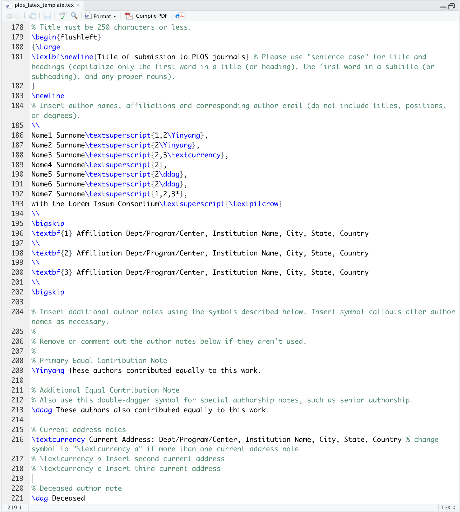
```

]


--
.pull-right[
```{r}
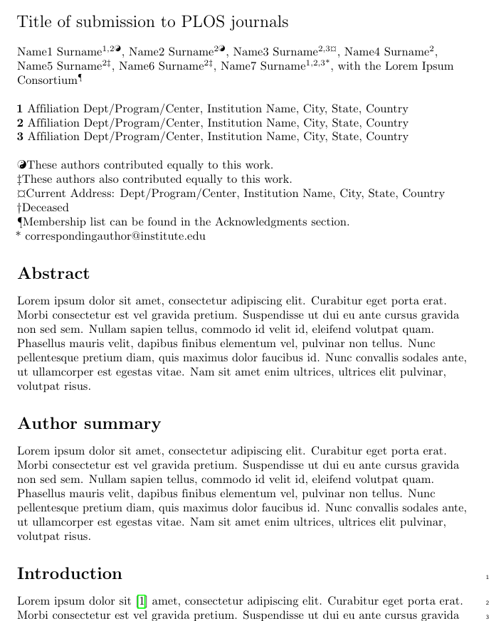
```
]


---
## Using LaTeX templates with R Markdown
.pull-left[
```yaml
---
output: 
  bookdown::pdf_document2:
    template: plos_latex_template.tex
---
```
]


--
.pull-right[
```{r}
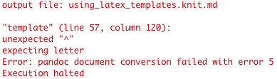
```
]

---
# 3 steps in adapting a LaTeX template

1. Make the template compile correctly with just the template content (watch out for `$` signs)

--

2. Pull in the content you want from the YAML header and body of your R Markdown source file, by plugging the relevant variable into the LaTeX template surrounded by dollar signs

--

3. Enable code inclusion, by adding this at the top of the **.tex** template (otherwise you'll get an error when you try to show code blocks in your compiled file)

```latex
$if(highlighting-macros)$
$highlighting-macros$
$endif$
```


---
class: center, middle, inverse


---
class: larger-body

## plos_latex_template.tex
- Dollar signs have special meaning for `pandoc`


--
- in the template document, `pandoc` will look for stuff wrapped in dollar signs and insert the corresponding content in your **.Rmd** file, before the output document is created


--
- `$` is escaped with another `$`


--
.pull-left[
If we take a look at line 57 in **plos_latex_template.tex** we see this:
```latex
% For example, x$^2$ is incorrect; 
this should be formatted as $x^2$ 
(or $\mathrm{x}^2$ if the romanized font is desired).
```
]


--
.pull-right[
- Change to this:<br>
<br>

```latex
% For example, x$$^2$$ is incorrect; 
this should be formatted as $$x^2$$ 
(or $$\mathrm{x}^2$$ if the romanized font is desired).
```
]

---
class: center, middle, inverse

# Demo

---

class: larger-body

## plos_latex_template.tex
- Fix this throughout and we get normal compilation of the LaTeX template to PDF:


--
.pull-left[

```yaml
---
output: 
  bookdown::pdf_document2:
    template: plos_latex_template_adapted.tex
---
```

```{r, out.width="88%", fig.align='center'}
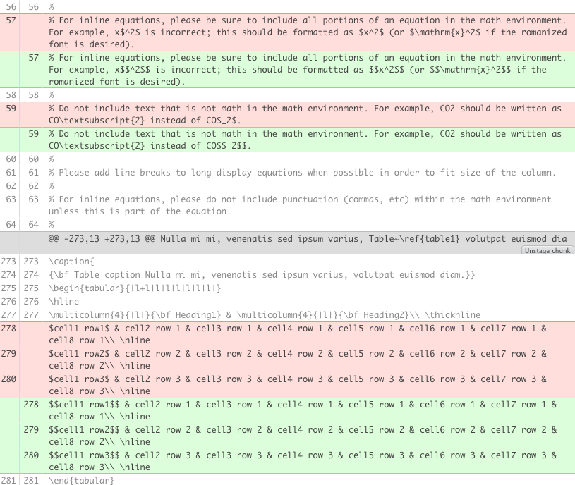
```


]


--
.pull-right[

```{r, out.width = "95%"}

```
]

---
class: larger-body

## Plug in information from our **.Rmd** file
- Find the places in the LaTeX template where you want to insert content from your R Markdown document

--
- Wrap variables from your YAML header in `$`'s to insert them, e.g. `\textbf\newline{$title$}` 

--
- To insert all the content after your YAML header, type `$body$`


--
.pull-left[
```latex
\textbf\newline{Title of submission to PLOS journals}
\\
Name1 Surname\textsuperscript{1,2\Yinyang},
Name2 Surname\textsuperscript{2\Yinyang},
Name3 Surname\textsuperscript{2,3\textcurrency},
Name4 Surname\textsuperscript{2},
Name5 Surname\textsuperscript{2\ddag},
Name6 Surname\textsuperscript{2\ddag},
Name7 Surname\textsuperscript{1,2,3*},
with the Lorem Ipsum Consortium\textsuperscript{\textpilcrow}
\\
\textbf{1} Affiliation Dept/Program/Center, Institution Name, City, State, Country
\\
\textbf{2} Affiliation Dept/Program/Center, Institution Name, City, State, Country
```
]

.pull-right[
```latex
*\textbf\newline{$title$}
\\
*$author.name$\textsuperscript{1,2\Yinyang},
Name2 Surname\textsuperscript{2\Yinyang},
Name3 Surname\textsuperscript{2,3\textcurrency},
Name4 Surname\textsuperscript{2},
Name5 Surname\textsuperscript{2\ddag},
Name6 Surname\textsuperscript{2\ddag},
Name7 Surname\textsuperscript{1,2,3*},
with the Lorem Ipsum Consortium\textsuperscript{\textpilcrow}
\\
*\textbf{1} $author.affiliation$, $author.city$, $author.country$
\\
\textbf{2} Affiliation Dept/Program/Center, Institution Name, City, State, Country
```
]


---
## Plug in information from our **.Rmd** file

.pull-left[
```latex
\section*{Abstract}
Lorem ipsum dolor sit amet...
```

```latex
\section*{Introduction}
Lorem ipsum dolor sit...
```

]

.pull-right[
```latex
\section*{Abstract}
$abstract$
```

```latex
$body$
```
]

---
## Plug in information from our **.Rmd** file

.pull-left[
```yaml
---
title: This Is the Greatest and Best Paper in the World (Tribute)
abstract: This is the best abstract in the world
author:
  name: Ulrik Lyngs
  affiliation: Department of Computer Science, University of Oxford
  city: Oxford
  country: United Kingdom
output: 
  bookdown::pdf_document2:
    template: plos_latex_template_adapted.tex
---

# Introduction

"Tribute" is the first single of Tenacious D's self-titled debut album. 
It was released July 16, 2002.
The song is a tribute to what Gass and Black refer to as "The Greatest Song in the World" (often confused as the song's title), which Tenacious D themselves came up with, but have since forgotten. 
It was released as a downloadable track for Rock Band in addition to appearing as a playable track for Guitar Hero Live.

```
]

.pull-right[
```{r, out.width="88%"}
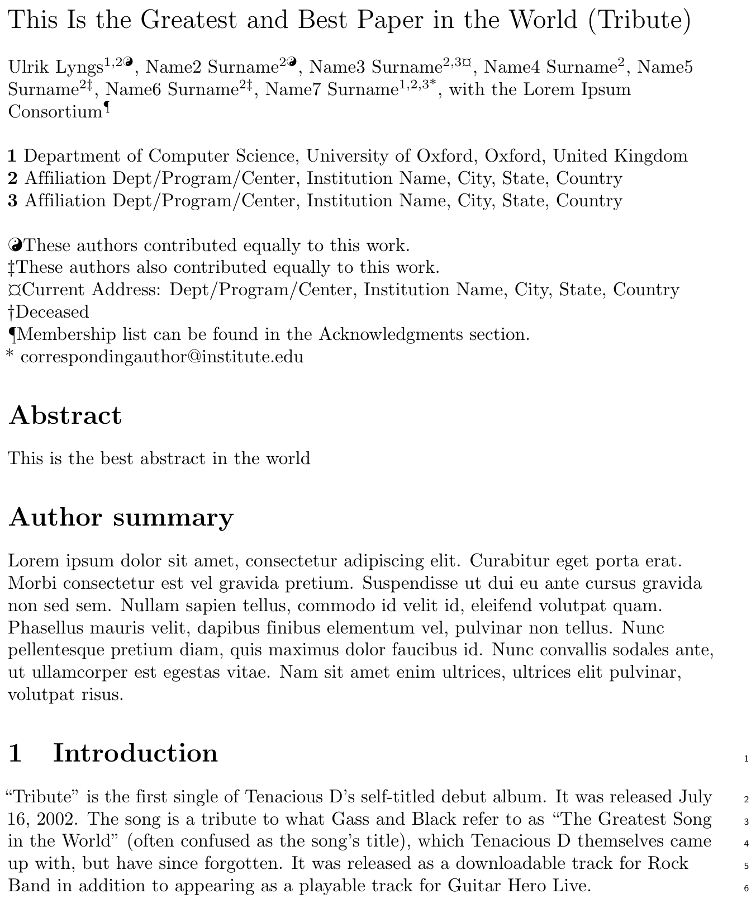
```

]

---
class: center, middle

# That's all, folks!

<iframe src="https://giphy.com/embed/l0NhZ0aUSE8fXag12" width="900" height="450" frameBorder="0" class="giphy-embed" allowFullScreen></iframe>

[ulyngs.github.io/rmarkdown-workshop-2019](https://ulyngs.github.io/rmarkdown-workshop-2019/)
